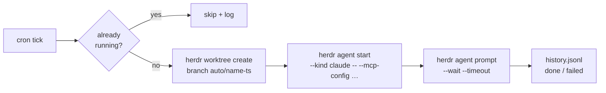

# herdr-automations

**Cron for your coding agents.** Schedule a prompt — Herdr wakes an agent in a fresh worktree and runs it. While you sleep.

[](LICENSE)
[](go.mod)
[](https://herdr.dev)

```yaml
automations:
  - name: issue-triage
    cron: "0 9 * * 1-5"
    repo: ~/Projects/myapp
    prompt: |
      Triage new GitHub issues: label them, close duplicates,
      draft replies for the ones needing more info.
```

That's the whole feature. Every weekday at 9:00, a Claude (or Codex, or opencode…) agent spawns in a fresh git worktree of `myapp`, gets that prompt, and works until it's done. You arrive to triaged issues and a run log.

## Why

[Herdr](https://herdr.dev) keeps your agents alive when you close the laptop — but *you* still have to start them. Recurring chores (issue triage, dependency bumps, nightly test-flake hunts, changelog drafts) deserve better than you retyping the same prompt every morning.

`herdr-automations` is the **trigger layer** the ecosystem was missing:

|  | [herdr-workflows](https://github.com/aorumbayev/herdr-workflows) | **herdr-automations** |
|---|---|---|
| Answers | *"what steps to run?"* | *"**when** to run them?"* |
| Model | multi-step YAML workflows, run on demand | prompt + cron, fired on schedule |
| Together | `workflow: nightly-deps` in an automation runs a herdr-workflows workflow on a schedule | |

## Highlights

- **One YAML entry per automation** — no DSL, no UI required, versionable
- **Fresh worktree per run** (branch `auto/<name>-<timestamp>`), or the repo root — your working copy is never touched
- **Agent-agnostic** — anything `herdr agent start` supports: `claude`, `codex`, `opencode`, `gemini`, `cursor`, …
- **MCP attach** — `mcp_config: path.json` hands the agent its MCP servers (GitHub, Slack, your DB…)
- **Overlap guard** — a tick that fires while the previous run is still working is *skipped*, never queued into a pile-up
- **Full run history** — append-only JSONL: `scheduled → running → done | failed | skipped`, with workspace and pane IDs to jump back into
- **Live board** — an overlay pane inside Herdr: next run, last status, `r` to run now
- **Agents can self-schedule** — a bundled [skill](skills/creating-automations/SKILL.md) teaches Claude Code the format: say *"bump my deps every night"* and the agent writes the entry itself
- **One static Go binary** — no Node, no Python, no runtime on the machine

## Quick start

```bash
herdr plugin install DnzzL/herdr-automations   # builds itself (needs Go)
herdr-automations add                          # wizard: validates cron, previews next 3 runs
```

Or write the YAML yourself — `herdr plugin config-dir dnzzl.automations` → `automations.yaml`, full reference in [`automations.example.yaml`](automations.example.yaml). The daemon picks up edits within 30 seconds, no restart.

```bash
herdr-automations list             # schedule + last run per automation
herdr-automations run issue-triage # trigger now, don't wait for cron
herdr-automations history         # what ran, when, how it ended
```

Inside Herdr: open the **Automations** pane (overlay) or hit the *"Automations: run now"* action.

## How a run works



Everything goes through the `herdr` CLI — the same socket API agents themselves use. No private hooks, nothing to break on Herdr upgrades.

## Full entry reference

```yaml
automations:
  - name: issue-triage            # unique, kebab-case
    cron: "0 9 * * 1-5"           # 5-field crontab, or @daily / @hourly / @weekly
    repo: ~/Projects/myapp
    workspace: worktree           # worktree (default) | root
    agent: claude                 # any `herdr agent start --kind`
    prompt: "…"                   # OR workflow: <name>  (delegates to hwf run)
    mcp_config: ~/.config/mcp/github.json   # optional → --mcp-config
    agent_args: ["--model", "opus"]         # optional, verbatim agent flags
    timeout_minutes: 60           # optional bound on the run
    disabled: true                # optional: keep it, don't schedule it
```

## FAQ

**Does my machine need to be awake?** The Herdr *server* does. Herdr's whole point is running headless — a home server, a VPS, a Mac that doesn't sleep.

**What happens to the worktrees?** They accumulate as reviewable workspaces — each run is a branch you can inspect, merge, or `herdr worktree remove`. Auto-cleanup of merged runs is on the roadmap.

**Event triggers (on push, on PR, on `worktree.created`)?** Planned — Herdr's plugin manifest already supports `[[events]]`; cron came first because it's 90% of the value.

## Development

```bash
go build -o bin/herdr-automations . && go test ./...
herdr plugin link .        # use your checkout as the installed plugin
```

PRs welcome — especially new event triggers, run cleanup policies, and agent kinds tested in the wild.

## License

[MIT](LICENSE)
